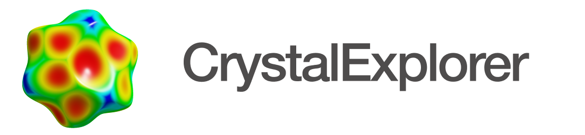

<div align="center">
  <picture>
    <source media="(prefers-color-scheme: dark)" srcset="icons/ce_header_dark.png">
    <source media="(prefers-color-scheme: light)" srcset="icons/ce_header.png">
    
  </picture>
  <p>
    <a href="https://github.com/peterspackman/crystalexplorer/actions/workflows/build_and_test.yml"></a>
    <a href="https://github.com/peterspackman/crystalexplorer/releases/latest"></a>
    <a href="https://github.com/peterspackman/crystalexplorer/blob/main/COPYING.LESSER"></a>
    <a href="https://doi.org/10.1107/S1600576721002910"></a>
  </p>
</div>

CrystalExplorer is now open source, available under LGPLv3 license terms. See [COPYING.LESSER](COPYING.LESSER) for more details.

## Features

CrystalExplorer has undergone significant improvements with several major updates:

- **Modern OpenGL Renderer**: The rendering engine has been completely rewritten using modern OpenGL, providing improved performance and visual quality
- **OCC Integration**: Migrated from Tonto to Open Chemistry Crystallography (OCC) backend for more efficient crystallographic calculations
- **Parallel Task Execution**: Computational tasks can now run concurrently, significantly improving performance for complex calculations
- **XTB Support**: Added integration with extended tight-binding method for faster quantum mechanical calculations

The software is under active development, with ongoing work to stabilize the new features and implementations.
Project file serialization has been improved with better support for interaction energies, wavefunctions, and bond overrides.

## Build Instructions

Building CrystalExplorer requires:
- CMake 3.15+
- Qt 6.5+
- A C++17 compatible compiler

```bash
# Configure the project
cmake -B build -DCMAKE_BUILD_TYPE=Release

# Build the program
cmake --build build

# Run tests (optional)
ctest --test-dir build

# Build the package (e.g. dmg on macOS, AppImage on Linux, exe installer on Windows)
cmake --build build --target package
```

You can also use presets for platform-specific configurations:

```bash
# List available presets
cmake --list-presets

# Configure using a preset
cmake --preset macos-arm64

# Build using a preset
cmake --build --preset macos-arm64
```


## Documentation

Visit the [CrystalExplorer website](https://crystalexplorer.net) for full documentation and tutorials.

## Download

Pre-built packages for Windows, macOS, and Linux are available in the [Releases](https://github.com/peterspackman/crystalexplorer/releases) section.

## Citation

If you use CrystalExplorer in your research, please cite:

```bibtex
@article{Spackman:oc5008,
  author  = "Spackman, Peter R. and Turner, Michael J. and McKinnon, Joshua J. and Wolff, Stephen K. and Grimwood, Daniel J. and Jayatilaka, Dylan and Spackman, Mark A.",
  title   = "{{\it CrystalExplorer}: a program for Hirshfeld surface analysis, visualization and quantitative analysis of molecular crystals}",
  journal = "Journal of Applied Crystallography",
  year    = "2021",
  volume  = "54",
  number  = "3",
  month   = "Jun",
  doi     = {10.1107/S1600576721002910},
  url     = {https://doi.org/10.1107/S1600576721002910}
}
```

For specific features or modules, please see the [citation guide](https://crystalexplorer.net/docs/how-to-cite).
